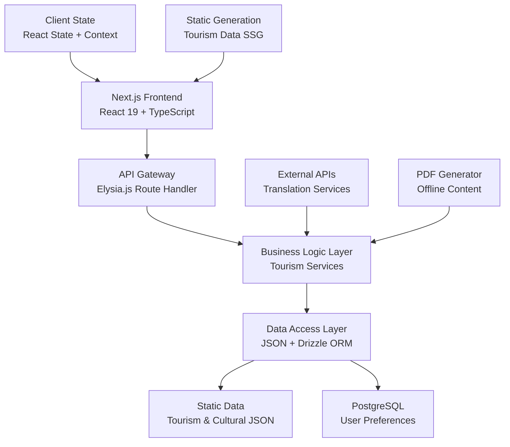
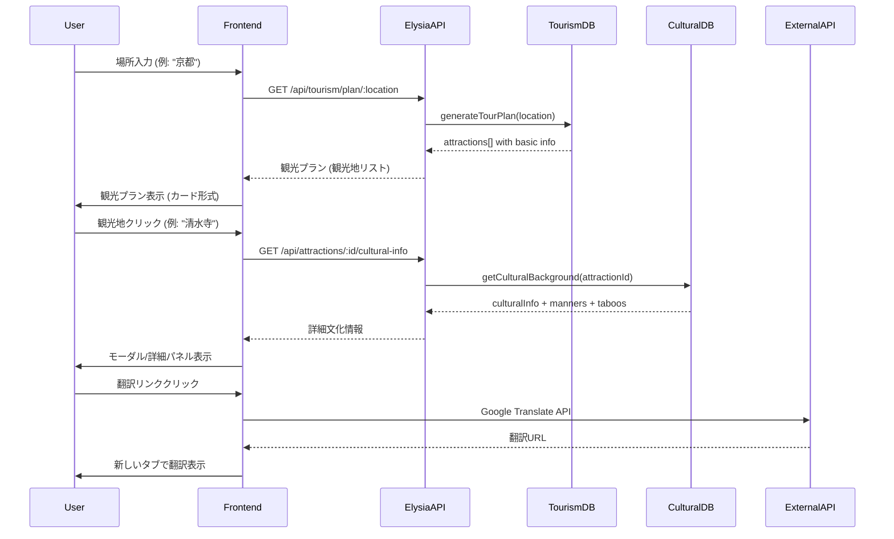
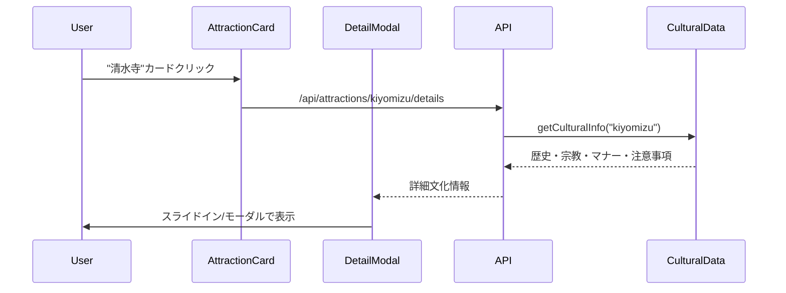
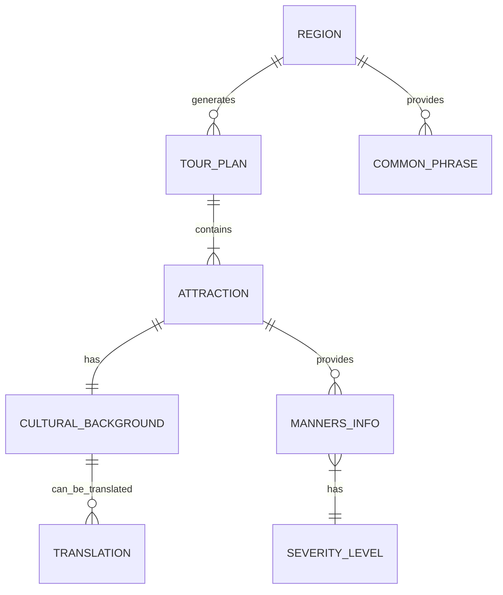

# Technical Design

## Overview

CultureSyncは、Next.js 15 + Elysia.js テンプレートを基盤とした場所ベース観光プラン生成システムです。25分の制約時間内での実装を前提とし、大まかな場所入力から観光プラン表示、観光地クリックによる詳細文化情報表示まで、直感的でスムーズなユーザー体験を提供します。軽量JSON観光・文化データベース、インタラクティブプラン表示、詳細文化情報モーダルを統合したモノリス構成で実装します。

## Requirements Mapping

### Design Component Traceability

各設計コンポーネントは更新された要件に対応します：

- **TourPlanGeneratorService** → REQ-1: 場所ベース観光プラン生成システム
- **AttractionDetailSystem** → REQ-2: 観光地別文化的背景情報表示システム  
- **TranslationLinkProvider** → REQ-3: 翻訳リンク付き観光地情報システム
- **InteractiveUI Components** → REQ-4: ユーザーインターフェースと体験
- **DataIntegrityManager** → REQ-5: データ管理と信頼性

### User Story Coverage

更新された要件のユーザーストーリーに対する技術的アプローチ：

- **場所入力からプラン生成**: 地域ベース観光地データベースと自動プラン生成アルゴリズム
- **観光地クリックで文化情報**: React State管理とモーダル/詳細パネル展開システム
- **文化的背景表示**: 観光地別に紐づけられた詳細文化データと段階的情報表示
- **翻訳機能統合**: 外部翻訳API統合とオフライン対応PDF生成
- **直感的UI/UX**: Next.js App Router + TailwindCSS による流れるようなインタラクション

## Architecture

### システム全体アーキテクチャ



### Technology Stack

瞬作大会制約と新フローに最適化された技術選定：

- **Frontend**: Next.js 15.4.5 + React 19.1.1 + TypeScript 5.9.2
- **Backend**: Elysia.js 1.3.8 + 既存Catch-allルート拡張
- **Database**: Drizzle ORM 0.44.4 (設定済み) + Vercel Postgres
- **Static Data**: JSON + TypeScript型定義による観光・文化データベース
- **Styling**: TailwindCSS 4.1.11 (設定済み) + アニメーション強化
- **State Management**: React Context + useState for UI interactions
- **External APIs**: Google Translate API / DeepL API
- **PDF Generation**: React-PDF または html2pdf
- **Caching**: Next.js Static Generation + Client-side state caching

### Architecture Decision Rationale

新フローに基づく技術選択の根拠：

- **Why JSON Tourism Database**: 観光地情報の静的配信、高速検索、型安全性確保
- **Why React State Management**: 観光地クリック→詳細表示の即座レスポンス
- **Why Modal/Panel UI Pattern**: 観光プランから詳細への自然な遷移
- **Why Component-based Architecture**: 観光地カード→詳細パネルの再利用性

## Data Flow

### システム全体データフロー

場所入力から文化情報表示までの新しいフロー：



### 主要ユーザーフロー

#### 1. 観光プラン生成フロー

```mermaid
sequenceDiagram
    participant User
    participant LocationInput
    participant API
    parameter TourismData
    
    User->>LocationInput: 場所名入力 "京都"
    LocationInput->>API: /api/tourism/plan?location=kyoto
    API->>TourismData: findAttractionsByRegion("kyoto")
    TourismData-->>API: [清水寺, 金閣寺, 伏見稲荷, 嵐山, 祇園]
    API-->>LocationInput: 観光プラン + 基本情報
    LocationInput-->>User: 観光地カードリスト表示
```

#### 2. 観光地詳細情報表示フロー



## Components and Interfaces

### Backend Services & Method Signatures

新フローに対応したElysia.jsベースサービス層：

```typescript
class TourismPlanService {
  async generateTourPlan(location: string): Promise<TourPlan>           // 観光プラン生成
  async getAttractionsByRegion(region: string): Promise<Attraction[]>  // 地域別観光地取得
  async validateLocation(location: string): Promise<boolean>           // 場所存在確認
  async getPopularAttractions(region: string, limit: number): Promise<Attraction[]> // 人気観光地
}

class AttractionDetailService {
  async getAttractionDetails(attractionId: string): Promise<AttractionDetail>     // 観光地詳細取得
  async getCulturalBackground(attractionId: string): Promise<CulturalBackground> // 文化的背景情報
  async getMannersAndTaboos(attractionId: string): Promise<MannersInfo>          // マナー・タブー情報
  async getHistoricalContext(attractionId: string): Promise<HistoricalInfo>      // 歴史的背景
}

class TranslationService {
  async generateTranslationLinks(attractionId: string, targetLang: string): Promise<TranslationLink[]>  // 翻訳リンク生成
  async getLocalPhrases(region: string): Promise<CommonPhrase[]>                                       // 現地フレーズ取得
  async generateOfflinePDF(attractionDetails: AttractionDetail): Promise<Buffer>                       // PDF生成
}
```

### Frontend Components

新フローに最適化されたコンポーネント設計：

| Component Name          | Responsibility                 | Props/State Summary                                                     |
| ----------------------- | ------------------------------ | ----------------------------------------------------------------------- |
| `LocationSearchInput`   | 場所入力とオートコンプリート   | `onLocationSelect: (location: string) => void, suggestions: string[]`   |
| `TourPlanView`          | 観光プラン表示 (リスト/マップ) | `attractions: Attraction[], viewMode: 'list'\|'map', onAttractionClick` |
| `AttractionCard`        | 個別観光地カード               | `attraction: Attraction, onClick: () => void, showBasicInfo: boolean`   |
| `AttractionDetailModal` | 観光地詳細モーダル/パネル      | `attraction: AttractionDetail, isOpen: boolean, onClose: () => void`    |
| `CulturalInfoSection`   | 文化情報セクション             | `culturalInfo: CulturalBackground, showWarnings: boolean`               |
| `TranslationToolbar`    | 翻訳ツールバー                 | `attractionName: string, phrases: CommonPhrase[]`                       |
| `InteractiveMap`        | インタラクティブマップ         | `attractions: Attraction[], onMarkerClick: (id: string) => void`        |

### API Endpoints

新フローに対応した詳細APIエンドポイント設計：

| Method | Route                                | Purpose                         | Auth | Status Codes  |
| ------ | ------------------------------------ | ------------------------------- | ---- | ------------- |
| GET    | `/api/tourism/plan/:location`        | 場所ベース観光プラン生成        | None | 200, 404, 500 |
| GET    | `/api/tourism/attractions/search`    | 観光地検索 (オートコンプリート) | None | 200, 400, 500 |
| GET    | `/api/attractions/:id`               | 観光地基本情報取得              | None | 200, 404, 500 |
| GET    | `/api/attractions/:id/cultural-info` | 観光地文化的背景詳細            | None | 200, 404, 500 |
| GET    | `/api/attractions/:id/manners`       | マナー・タブー情報              | None | 200, 404, 500 |
| POST   | `/api/translation/links`             | 翻訳リンク生成                  | None | 200, 400, 500 |
| GET    | `/api/translation/phrases/:region`   | 現地フレーズ取得                | None | 200, 404, 500 |
| POST   | `/api/translation/pdf`               | オフラインPDF生成               | None | 200, 400, 500 |
| POST   | `/api/feedback/attraction`           | 観光地情報フィードバック        | None | 201, 400, 500 |

## Data Models

### Domain Entities

新フローに対応したドメインエンティティ：

1. **TourPlan**: 生成された観光プラン情報
2. **Attraction**: 観光地基本情報エンティティ
3. **CulturalBackground**: 観光地別文化的背景情報
4. **MannersInfo**: マナー・タブー・注意事項情報
5. **Region**: 地域・場所情報エンティティ
6. **Translation**: 翻訳情報エンティティ

### Entity Relationships



### Data Model Definitions

新フローに最適化されたTypeScript型定義：

```typescript
interface TourPlan {
  id: string;
  location: string;
  region: string;
  attractions: Attraction[];
  generatedAt: Date;
  recommendedOrder: string[];
  estimatedDuration: string; // "1 day", "2-3 days"
  totalAttractions: number;
}

interface Attraction {
  id: string;
  name: string;
  nameLocal: string;
  category: 'temple' | 'shrine' | 'museum' | 'park' | 'district' | 'castle';
  importance: 'high' | 'medium' | 'low';
  location: {
    latitude: number;
    longitude: number;
    address: string;
    addressLocal: string;
  };
  basicInfo: {
    description: string;
    openingHours: string;
    admissionFee: string;
    duration: string; // "1-2 hours"
  };
  imageUrl?: string;
  region: string;
}

interface CulturalBackground {
  id: string;
  attractionId: string;
  historicalBackground: string;
  religiousSignificance: string;
  culturalImportance: string;
  architecturalStyle: string;
  notableFeatures: string[];
  relatedEvents: string[];
  source: string;
  reliability: number; // 0-100
  lastUpdated: Date;
}

interface MannersInfo {
  id: string;
  attractionId: string;
  generalManners: string[];
  clothingRequirements: string[];
  photographyRules: {
    allowed: boolean;
    restrictions: string[];
    forbiddenAreas: string[];
  };
  behaviorTaboos: {
    severity: 'critical' | 'warning' | 'info';
    description: string;
    consequences: string;
  }[];
  visitingTips: string[];
  bestVisitTimes: string[];
  lastVerified: Date;
}

interface Region {
  code: string;
  name: string;
  nameLocal: string;
  countryCode: string;
  languages: string[];
  currency: string;
  timezone: string;
  culturalComplexity: number; // 1-10
  mainAttractions: string[]; // attraction IDs
}

interface CommonPhrase {
  id: string;
  region: string;
  category: 'directions' | 'admission' | 'photography' | 'courtesy';
  japanese: string;
  localLanguage: string;
  pronunciation: string;
  contextUsage: string;
  importance: 'essential' | 'useful' | 'optional';
}
```

### JSON Database Schema

場所ベース観光プラン対応の静的データベース構造：

```typescript
// public/data/tourism-database.json
interface TourismDatabase {
  version: string;
  lastUpdated: string;
  regions: {
    [regionCode: string]: {
      info: Region;
      attractions: Attraction[];
      culturalBackgrounds: CulturalBackground[];
      mannersInfo: MannersInfo[];
      phrases: CommonPhrase[];
      recommendedPlans: {
        duration: string;
        attractions: string[]; // attraction IDs in order
        description: string;
      }[];
    }
  };
}

// 使用例
const tourismDB: TourismDatabase = {
  version: "1.0.0",
  lastUpdated: "2025-08-04T00:00:00Z",
  regions: {
    "kyoto": {
      info: { code: "kyoto", name: "京都", nameLocal: "京都市", countryCode: "JP", ... },
      attractions: [
        { id: "kiyomizu", name: "清水寺", category: "temple", importance: "high", ... },
        { id: "kinkaku", name: "金閣寺", category: "temple", importance: "high", ... }
      ],
      culturalBackgrounds: [
        { id: "kiyomizu-bg", attractionId: "kiyomizu", historicalBackground: "...", ... }
      ],
      mannersInfo: [
        { id: "kiyomizu-manners", attractionId: "kiyomizu", photographyRules: {...}, ... }
      ],
      phrases: [ /* 京都特有フレーズ */ ],
      recommendedPlans: [
        { duration: "1 day", attractions: ["kiyomizu", "kinkaku", "gion"], ... }
      ]
    }
  }
};
```

### Database Schema (PostgreSQL)

ユーザー関連データとフィードバック管理：

```sql
-- ユーザー設定テーブル
CREATE TABLE user_preferences (
  id SERIAL PRIMARY KEY,
  session_id VARCHAR(255),
  preferred_regions TEXT[],
  language_preference VARCHAR(10),
  favorite_attractions TEXT[],
  view_mode VARCHAR(20) DEFAULT 'list', -- 'list' or 'map'
  created_at TIMESTAMP DEFAULT NOW(),
  updated_at TIMESTAMP DEFAULT NOW()
);

-- 観光地フィードバックテーブル
CREATE TABLE attraction_feedback (
  id SERIAL PRIMARY KEY,
  attraction_id VARCHAR(255),
  feedback_type VARCHAR(50), -- 'cultural_info', 'manners', 'translation'
  description TEXT,
  user_session VARCHAR(255),
  rating INTEGER CHECK (rating >= 1 AND rating <= 5),
  created_at TIMESTAMP DEFAULT NOW()
);

-- 観光プラン使用統計
CREATE TABLE plan_usage_analytics (
  id SERIAL PRIMARY KEY,
  region VARCHAR(255),
  attractions_viewed TEXT[],
  plan_duration VARCHAR(50),
  completion_rate DECIMAL(3,2), -- 0.00 to 1.00
  date DATE DEFAULT CURRENT_DATE
);
```

## Error Handling

### 包括的エラーハンドリング戦略

新フローに対応したエラーハンドリング：

```typescript
// カスタムエラータイプ定義
class TourismPlanError extends Error {
  constructor(
    message: string,
    public code: string,
    public statusCode: number = 500
  ) {
    super(message);
    this.name = 'TourismPlanError';
  }
}

// 新フロー特有のエラーケース
const ERRORS = {
  LOCATION_NOT_FOUND: new TourismPlanError('指定された場所の観光情報が見つかりません', 'LOCATION_NOT_FOUND', 404),
  ATTRACTION_NOT_FOUND: new TourismPlanError('観光地が見つかりません', 'ATTRACTION_NOT_FOUND', 404),
  CULTURAL_INFO_UNAVAILABLE: new TourismPlanError('文化情報が利用できません', 'CULTURAL_INFO_UNAVAILABLE', 404),
  PLAN_GENERATION_FAILED: new TourismPlanError('観光プラン生成に失敗しました', 'PLAN_GENERATION_FAILED', 500),
  TRANSLATION_SERVICE_ERROR: new TourismPlanError('翻訳サービスエラー', 'TRANSLATION_SERVICE_ERROR', 503)
};

// フロー特有のエラーリカバリー
const errorRecovery = {
  locationNotFound: (input: string) => ({
    suggestions: findSimilarLocations(input),
    message: `"${input}"に近い場所を検索しています...`
  }),
  attractionDetailsError: (attractionId: string) => ({
    basicInfo: getBasicAttractionInfo(attractionId),
    message: '詳細情報を読み込み中です...'
  })
};
```

## Security Considerations

### データ保護とセキュリティ

観光・文化情報システム特有のセキュリティ要件：

#### Input Validation

```typescript
// 場所名検証
const validateLocationInput = (location: string): boolean => {
  // 基本的なサニタイゼーション
  const sanitized = location.replace(/<[^>]*>/g, '').trim();
  const locationPattern = /^[a-zA-Z0-9\u3040-\u309F\u30A0-\u30FF\u4E00-\u9FAF\s-]{1,50}$/;
  return locationPattern.test(sanitized) && sanitized.length > 0;
};

// 観光地ID検証
const validateAttractionId = (id: string): boolean => {
  const idPattern = /^[a-z0-9-_]{3,30}$/;
  return idPattern.test(id);
};
```

#### Data Integrity

- **Tourism Data Verification**: 観光地情報の定期的な正確性チェック
- **Cultural Source Attribution**: 全文化情報に学術的出典必須
- **Real-time Data Sync**: 営業時間・料金情報の自動更新

#### Rate Limiting

```typescript
// API呼び出し制限（新フロー対応）
const rateLimiter = {
  '/api/tourism/plan': { requests: 50, window: '15m' },
  '/api/attractions/*/cultural-info': { requests: 100, window: '15m' },
  '/api/translation': { requests: 30, window: '15m' }
};
```

## Performance & Scalability

### Performance Targets

新フローでの現実的なパフォーマンス目標：

| Metric                   | Target  | Measurement           |
| ------------------------ | ------- | --------------------- |
| Location Search Response | < 300ms | API response time     |
| Tour Plan Generation     | < 800ms | Complete plan display |
| Attraction Detail Load   | < 400ms | Modal/panel opening   |
| Cultural Info Display    | < 500ms | Content rendering     |
| Map View Rendering       | < 1s    | Interactive map load  |
| Translation Link Gen     | < 200ms | Link creation         |

### Caching Strategy

新フロー最適化キャッシュ戦略：

- **Tour Plan Cache**: 人気地域の事前生成プラン (24時間)
- **Attraction Details Cache**: 文化情報の積極的キャッシュ (1週間)
- **Image Cache**: 観光地画像のCDNキャッシュ
- **Search Suggestions Cache**: オートコンプリート候補の高速化

### Scalability Approach

```typescript
// 段階的スケーリング戦略（新フロー対応）
const scalingPlan = {
  Phase1: {
    locations: 10,           // 主要観光都市
    attractionsPerLocation: 10, // 主要観光地
    dataSize: '< 2MB',       // JSON総サイズ
    deployment: 'Vercel Single Region'
  },
  Phase2: {
    locations: 50,           // 全国主要都市
    attractionsPerLocation: 20, // 詳細観光地
    dataSize: '< 10MB',      // 分割JSON
    deployment: 'Multi-region CDN'
  },
  Phase3: {
    locations: 200,          // 国際対応
    attractionsPerLocation: 50, // 網羅的観光地
    dataSize: 'Dynamic',     // データベース移行
    deployment: 'Microservices Architecture'
  }
};
```

## Testing Strategy

### 新フロー対応テスト戦略

25分制約下での効率的テスト設計：

#### 必須テストケース

```typescript
// 観光プラン生成テスト（3分）
describe('Tourism Plan Generation', () => {
  test('should generate plan for valid location', async () => {
    const response = await fetch('/api/tourism/plan/kyoto');
    expect(response.status).toBe(200);
    const plan = await response.json();
    expect(plan.attractions).toBeDefined();
    expect(plan.attractions.length).toBeGreaterThanOrEqual(5);
  });
});

// 観光地詳細表示テスト（2分）
describe('Attraction Details', () => {
  test('should load cultural background for attraction', async () => {
    const response = await fetch('/api/attractions/kiyomizu/cultural-info');
    expect(response.status).toBe(200);
    const info = await response.json();
    expect(info.historicalBackground).toBeDefined();
    expect(info.religiousSignificance).toBeDefined();
  });
});

// UIフローテスト（2分）
describe('User Interface Flow', () => {
  test('should navigate from plan to attraction details', () => {
    // 場所入力 → プラン表示 → 観光地クリック → 詳細表示
    expect(true).toBe(true); // Placeholder for UI integration test
  });
});
```

#### 手動テストチェックリスト

瞬作大会での動作確認（5分以内）：

- [ ] 場所入力 → 観光プラン表示
- [ ] 観光地カードクリック → 詳細情報表示
- [ ] 文化的背景情報の表示確認
- [ ] 翻訳リンク → 外部サイト遷移
- [ ] リスト/マップ表示切り替え
- [ ] レスポンシブデザイン確認

### 実装優先度

25分制約での段階的実装戦略（新フロー対応）：

**Phase 1 (0-10分): 基本フロー**

- 場所入力コンポーネント
- JSON観光データベース作成
- 基本観光プラン表示

**Phase 2 (10-18分): 詳細情報**

- 観光地クリック → 詳細表示
- 文化的背景情報コンポーネント
- モーダル/パネルUI実装

**Phase 3 (18-25分): 翻訳・仕上げ**

- 翻訳リンク機能
- マップビュー実装
- UI調整・エラーハンドリング

**緊急対応 (25分超過時)**

- 最小限MVP: 場所入力 → プラン表示 → 簡易詳細表示
- ダミーデータでUI完成度重視
