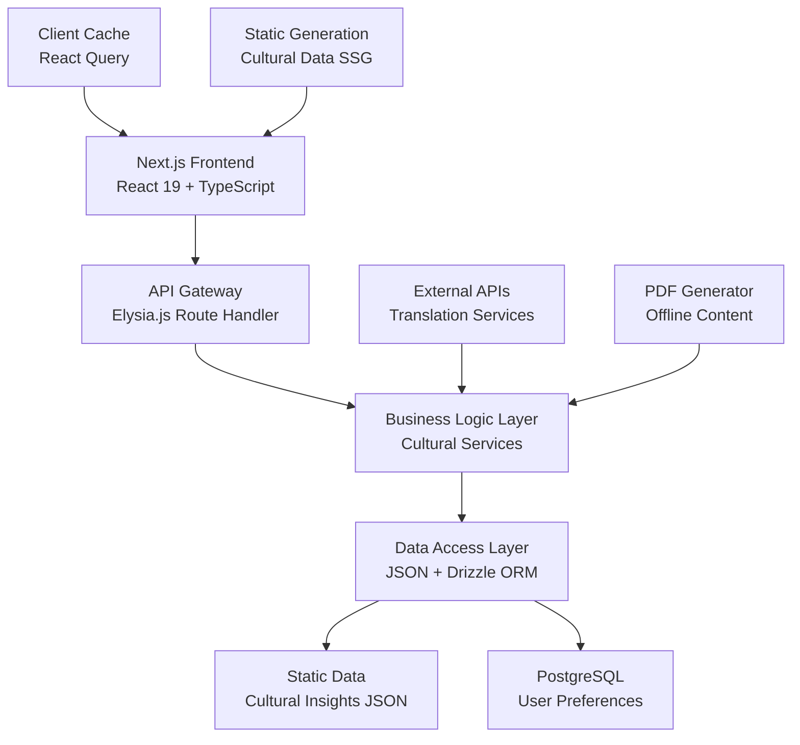
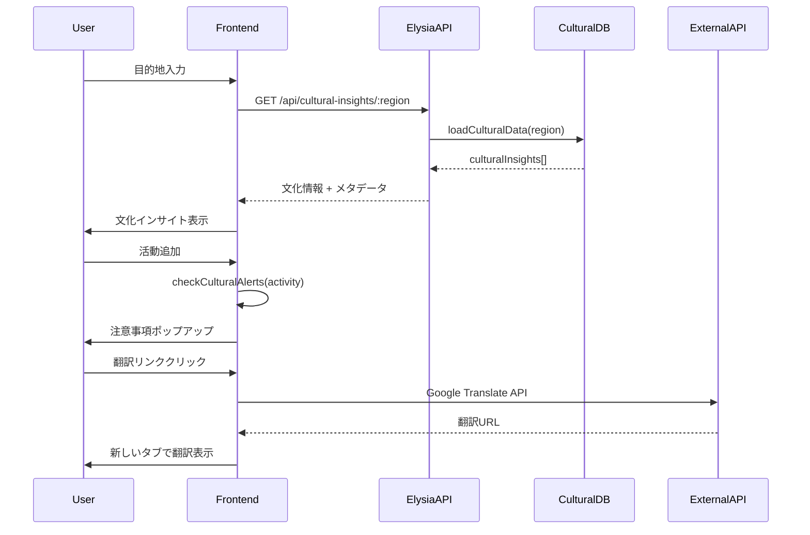
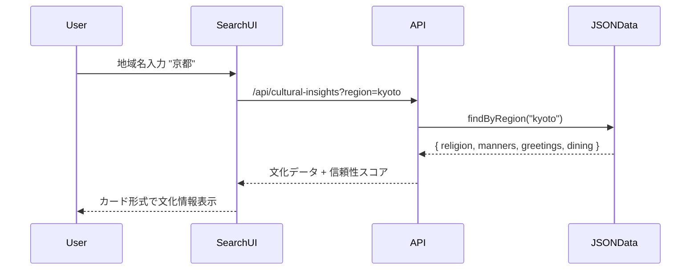
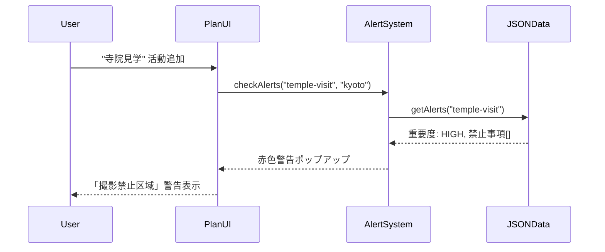
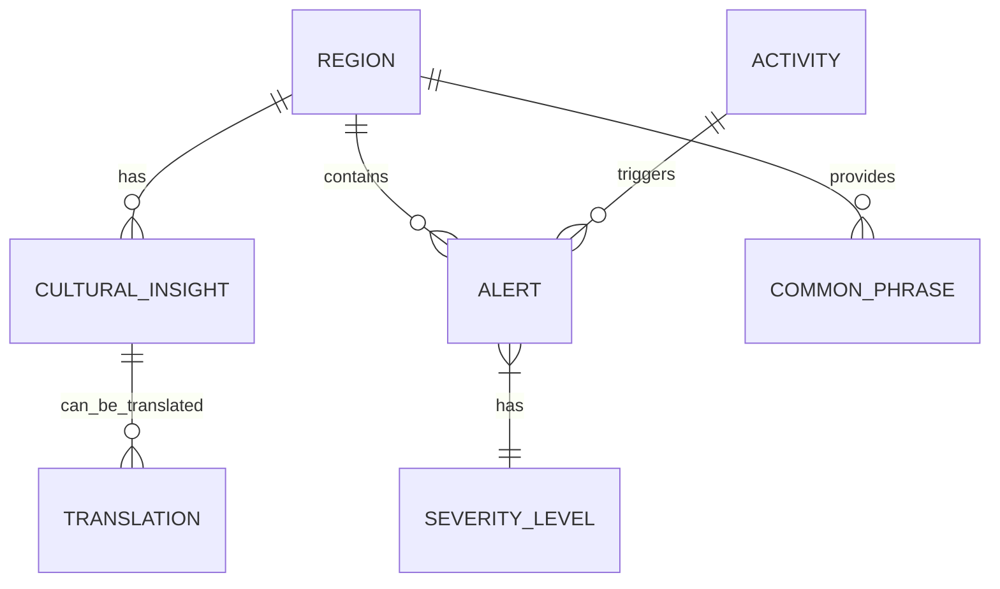
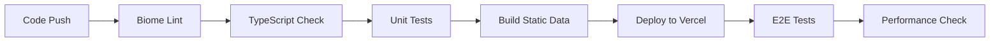

# Technical Design

## Overview

CultureSyncは、Next.js 15 + Elysia.js テンプレートを基盤とした文化的洞察提供システムです。25分の制約時間内での実装を前提とし、軽量JSON文化データベース、リアルタイム注意事項システム、翻訳統合機能を統合したモノリス構成で実装します。既存のDrizzle ORMパターンを活用しつつ、静的データ最適化とクライアントサイドキャッシュによる高速レスポンスを実現します。

## Requirements Mapping

### Design Component Traceability

各設計コンポーネントは特定の要件に対応します：

- **CulturalInsightService** → REQ-1: 文化インサイト自動挿入システム
- **AlertPopupSystem** → REQ-2: 文化的注意事項ポップアップシステム  
- **TranslationLinkProvider** → REQ-3: 翻訳リンク付き観光情報システム
- **ResponsiveUI Components** → REQ-4: ユーザーインターフェースと体験
- **DataIntegrityManager** → REQ-5: データ管理と信頼性

### User Story Coverage

要件定義のユーザーストーリーに対する技術的アプローチ：

- **文化情報自動取得**: 地域ベースJSONデータベースとTypeScript型安全インターフェース
- **適切なタイミング警告**: React Context + useEffect によるリアルタイム監視システム
- **現地語アクセス**: 外部翻訳API統合とオフライン対応PDF生成
- **直感的操作**: Next.js App Router + TailwindCSS レスポンシブUI
- **信頼性確保**: データバージョニングとソース管理システム

## Architecture

### システム全体アーキテクチャ



### Technology Stack

瞬作大会制約と既存アーキテクチャに最適化された技術選定：

- **Frontend**: Next.js 15.4.5 + React 19.1.1 + TypeScript 5.9.2
- **Backend**: Elysia.js 1.3.8 + 既存Catch-allルート拡張
- **Database**: Drizzle ORM 0.44.4 (設定済み) + Vercel Postgres
- **Static Data**: JSON + TypeScript型定義による文化データベース
- **Styling**: TailwindCSS 4.1.11 (設定済み)
- **External APIs**: Google Translate API / DeepL API
- **PDF Generation**: React-PDF または html2pdf
- **Caching**: Next.js Static Generation + Client-side caching

### Architecture Decision Rationale

技術選択の根拠（調査結果に基づく）：

- **Why JSON Database**: PostgreSQLセットアップ時間削減、静的データの高速アクセス、型安全性確保
- **Why Existing Elysia Integration**: 既存`[...elysia]/route.ts`パターン活用、設定時間ゼロ
- **Why Static Generation**: 文化データの変更頻度低、初期ロード高速化、CDN最適化
- **Why Client-side Caching**: APIコール削減、オフライン対応、UX向上

## Data Flow

### システム全体データフロー

文化情報取得から表示までの包括的フロー：



### 主要ユーザーフロー

#### 1. 文化情報検索フロー



#### 2. 注意事項アラートフロー



## Components and Interfaces

### Backend Services & Method Signatures

Elysia.jsベースサービス層の詳細設計：

```typescript
class CulturalInsightService {
  async getCulturalInsights(region: string): Promise<CulturalInsight[]>  // 地域文化情報取得
  async searchInsights(query: string): Promise<SearchResult[]>           // 文化情報検索
  async validateRegion(region: string): Promise<boolean>                // 地域存在確認
}

class AlertService {
  async checkCulturalAlerts(activity: string, region: string): Promise<Alert[]>  // 注意事項チェック
  async getAlertDetails(alertId: string): Promise<AlertDetail>                  // 詳細情報取得
  async reportFalseAlert(alertId: string, feedback: string): Promise<void>      // 誤情報報告
}

class TranslationService {
  async generateTranslationLinks(content: string, targetLang: string): Promise<TranslationLink[]>  // 翻訳リンク生成
  async getPhrases(region: string): Promise<CommonPhrase[]>                                       // 常用フレーズ取得
  async generateOfflinePDF(content: TranslationContent): Promise<Buffer>                          // PDF生成
}
```

### Frontend Components

| Component Name | Responsibility | Props/State Summary |
|---|---|---|
| `CulturalInsightCard` | 文化情報表示 | `insight: CulturalInsight, onExpand: () => void` |
| `AlertPopup` | 注意事項ポップアップ | `alert: Alert, onClose: () => void, severity: 'high'\|'medium'` |
| `TranslationLink` | 翻訳リンクボタン | `text: string, targetLang: string, provider: 'google'\|'deepl'` |
| `RegionSearchInput` | 地域検索入力 | `onRegionSelect: (region: Region) => void, autoComplete: boolean` |
| `CulturalDashboard` | メインダッシュボード | `selectedRegion: Region, activities: Activity[]` |
| `OfflinePDFGenerator` | PDF出力機能 | `content: TranslationContent, filename: string` |

### API Endpoints

Elysia.js統合による詳細APIエンドポイント設計：

| Method | Route | Purpose | Auth | Status Codes |
|---|---|---|---|---|
| GET | `/api/cultural-insights/:region` | 地域文化情報取得 | None | 200, 404, 500 |
| GET | `/api/cultural-insights/search` | 文化情報検索 | None | 200, 400, 500 |
| POST | `/api/alerts/check` | 注意事項チェック | None | 200, 400, 500 |
| GET | `/api/alerts/:id/details` | 注意事項詳細 | None | 200, 404, 500 |
| POST | `/api/translation/links` | 翻訳リンク生成 | None | 200, 400, 500 |
| GET | `/api/translation/phrases/:region` | 常用フレーズ取得 | None | 200, 404, 500 |
| POST | `/api/translation/pdf` | PDF生成 | None | 200, 400, 500 |
| POST | `/api/feedback/alerts` | 誤情報報告 | None | 201, 400, 500 |

## Data Models

### Domain Entities

1. **CulturalInsight**: 地域別文化情報エンティティ
2. **Alert**: 文化的注意事項エンティティ
3. **Region**: 地域情報エンティティ
4. **Translation**: 翻訳情報エンティティ
5. **Activity**: 活動・観光スポットエンティティ

### Entity Relationships



### Data Model Definitions

TypeScript型定義による厳密なデータモデル：

```typescript
interface CulturalInsight {
  id: string;
  region: string;
  countryCode: string;
  category: 'religion' | 'manners' | 'greetings' | 'dining' | 'clothing';
  title: string;
  description: string;
  importance: 'high' | 'medium' | 'low';
  source: string;
  reliability: number; // 0-100
  lastUpdated: Date;
  tags: string[];
}

interface Alert {
  id: string;
  activityType: string;
  region: string;
  severity: 'critical' | 'warning' | 'info';
  title: string;
  description: string;
  consequences: string[];
  alternatives: string[];
  legalRisk: boolean;
  lastVerified: Date;
}

interface Region {
  code: string;
  name: string;
  countryCode: string;
  languages: string[];
  currency: string;
  timezone: string;
  culturalComplexity: number; // 1-10
}

interface TranslationLink {
  id: string;
  originalText: string;
  targetLanguage: string;
  provider: 'google' | 'deepl';
  url: string;
  generatedAt: Date;
}

interface CommonPhrase {
  id: string;
  region: string;
  category: string;
  japanese: string;
  localLanguage: string;
  pronunciation: string;
  contextUsage: string;
}
```

### JSON Database Schema

静的文化データベースの構造設計：

```typescript
// public/data/cultural-insights.json
interface CulturalDatabase {
  version: string;
  lastUpdated: string;
  regions: {
    [regionCode: string]: {
      info: Region;
      insights: CulturalInsight[];
      alerts: Alert[];
      phrases: CommonPhrase[];
    }
  };
}

// 使用例
const culturalDB: CulturalDatabase = {
  version: "1.0.0",
  lastUpdated: "2025-08-04T00:00:00Z",
  regions: {
    "kyoto": {
      info: { code: "kyoto", name: "京都", countryCode: "JP", ... },
      insights: [ /* 文化情報配列 */ ],
      alerts: [ /* 注意事項配列 */ ],
      phrases: [ /* 常用フレーズ配列 */ ]
    }
  }
};
```

### Database Schema (PostgreSQL)

ユーザー関連データとフィードバック管理：

```sql
-- ユーザー設定テーブル
CREATE TABLE user_preferences (
  id SERIAL PRIMARY KEY,
  session_id VARCHAR(255),
  preferred_regions TEXT[],
  language_preference VARCHAR(10),
  alert_sensitivity VARCHAR(20),
  created_at TIMESTAMP DEFAULT NOW(),
  updated_at TIMESTAMP DEFAULT NOW()
);

-- フィードバックテーブル
CREATE TABLE alert_feedback (
  id SERIAL PRIMARY KEY,
  alert_id VARCHAR(255),
  feedback_type VARCHAR(50),
  description TEXT,
  user_session VARCHAR(255),
  created_at TIMESTAMP DEFAULT NOW()
);

-- 使用統計テーブル
CREATE TABLE usage_analytics (
  id SERIAL PRIMARY KEY,
  region VARCHAR(255),
  action_type VARCHAR(100),
  count INTEGER DEFAULT 1,
  date DATE DEFAULT CURRENT_DATE
);
```

## Error Handling

### 包括的エラーハンドリング戦略

```typescript
// カスタムエラータイプ定義
class CulturalInsightError extends Error {
  constructor(
    message: string,
    public code: string,
    public statusCode: number = 500
  ) {
    super(message);
    this.name = 'CulturalInsightError';
  }
}

// エラーハンドリングミドルウェア
const errorHandler = (error: Error) => {
  if (error instanceof CulturalInsightError) {
    return {
      error: {
        code: error.code,
        message: error.message,
        statusCode: error.statusCode
      }
    };
  }
  
  // 予期しないエラーの場合
  return {
    error: {
      code: 'INTERNAL_ERROR',
      message: 'システムエラーが発生しました',
      statusCode: 500
    }
  };
};

// 具体的なエラーケース
const ERRORS = {
  REGION_NOT_FOUND: new CulturalInsightError('地域が見つかりません', 'REGION_NOT_FOUND', 404),
  INVALID_ACTIVITY: new CulturalInsightError('無効な活動です', 'INVALID_ACTIVITY', 400),
  TRANSLATION_FAILED: new CulturalInsightError('翻訳サービスエラー', 'TRANSLATION_FAILED', 503),
  DATA_OUTDATED: new CulturalInsightError('データが古い可能性があります', 'DATA_OUTDATED', 202)
};
```

## Security Considerations

### データ保護とセキュリティ

文化情報システム特有のセキュリティ要件：

#### Input Validation
```typescript
// 地域コード検証
const validateRegionCode = (region: string): boolean => {
  const regionPattern = /^[a-z0-9-]{2,20}$/;
  return regionPattern.test(region) && !region.includes('script');
};

// 活動名検証
const validateActivity = (activity: string): boolean => {
  const sanitized = activity.replace(/<[^>]*>/g, ''); // HTMLタグ除去
  return sanitized.length > 0 && sanitized.length < 100;
};
```

#### Data Integrity
- **Static Data Verification**: JSONデータのハッシュ検証
- **Source Attribution**: 全文化情報に出典URL必須
- **Update Timestamps**: データ鮮度の自動チェック

#### Rate Limiting
```typescript
// API呼び出し制限
const rateLimiter = {
  '/api/cultural-insights': { requests: 100, window: '15m' },
  '/api/translation': { requests: 50, window: '15m' },
  '/api/feedback': { requests: 10, window: '15m' }
};
```

## Performance & Scalability

### Performance Targets

瞬作大会制約下での現実的なパフォーマンス目標：

| Metric | Target | Measurement |
|---|---|---|
| Initial Page Load | < 2s | Lighthouse |
| Cultural Data Fetch | < 500ms | API response time |
| Alert Check | < 200ms | React state update |
| Translation Link Gen | < 300ms | External API call |
| PDF Generation | < 3s | File download |
| Static Asset Load | < 1s | CDN delivery |

### Caching Strategy

多層キャッシュによる高速化：

- **Static Generation**: 文化データの事前生成 (Next.js SSG)
- **Browser Cache**: 文化情報の24時間キャッシュ
- **CDN Cache**: 静的JSONファイルのエッジキャッシュ
- **Memory Cache**: 頻繁アクセス地域データのRAMキャッシュ

### Scalability Approach

```typescript
// 段階的スケーリング戦略
const scalingPlan = {
  Phase1: {
    regions: 20,        // 主要観光地
    dataSize: '< 1MB',  // JSON総サイズ
    deployment: 'Vercel Single Region'
  },
  Phase2: {
    regions: 100,       // 拡張地域
    dataSize: '< 5MB',  // 分割JSON
    deployment: 'Multi-region CDN'
  },
  Phase3: {
    regions: 500,       // 全世界対応
    dataSize: 'Dynamic', // データベース移行
    deployment: 'Microservices + Cache'
  }
};
```

## Testing Strategy

### 瞬作大会対応テスト戦略

25分制約下での効率的テスト設計：

#### 必須テストケース
```typescript
// 文化データ取得テスト（2分）
describe('Cultural Insights API', () => {
  test('should return insights for valid region', async () => {
    const response = await fetch('/api/cultural-insights/kyoto');
    expect(response.status).toBe(200);
    const data = await response.json();
    expect(data.insights).toBeDefined();
    expect(data.insights.length).toBeGreaterThan(0);
  });
});

// アラートシステムテスト（2分）
describe('Alert System', () => {
  test('should trigger high-severity alert for temple photography', async () => {
    const alerts = await checkAlerts('photography', 'temple');
    expect(alerts).toContainEqual(
      expect.objectContaining({ severity: 'critical' })
    );
  });
});

// 翻訳リンクテスト（1分）
describe('Translation Links', () => {
  test('should generate valid Google Translate URL', () => {
    const link = generateTranslationLink('こんにちは', 'en');
    expect(link).toMatch(/translate\.google\.com/);
  });
});
```

#### 手動テストチェックリスト
瞬作大会での動作確認（5分以内）：

- [ ] 地域選択 → 文化情報表示
- [ ] 活動追加 → 注意事項ポップアップ
- [ ] 翻訳リンク → 外部サイト遷移
- [ ] レスポンシブデザイン確認
- [ ] エラーハンドリング動作

### CI/CD Pipeline

瞬作大会後の継続開発用パイプライン：



### 実装優先度

25分制約での段階的実装戦略：

**Phase 1 (0-12分): 文化インサイト**
- JSON文化データベース作成
- 基本API実装
- フロントエンド表示

**Phase 2 (12-20分): 注意事項システム**
- アラート判定ロジック
- ポップアップUI実装

**Phase 3 (20-25分): 翻訳機能**
- 翻訳リンク生成
- フレーズ表示機能

**緊急対応 (25分超過時)**
- 最小限MVP: 文化情報表示のみ
- ダミーデータでUI完成度重視